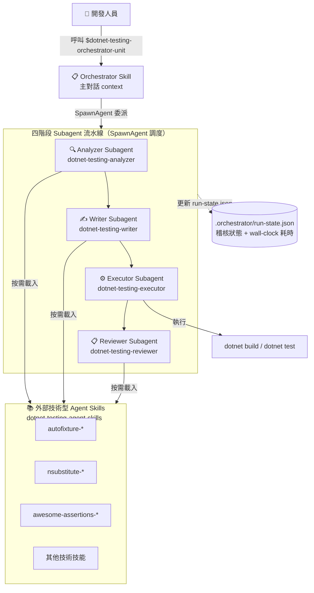
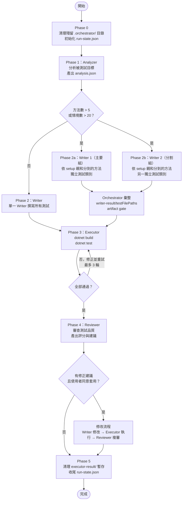
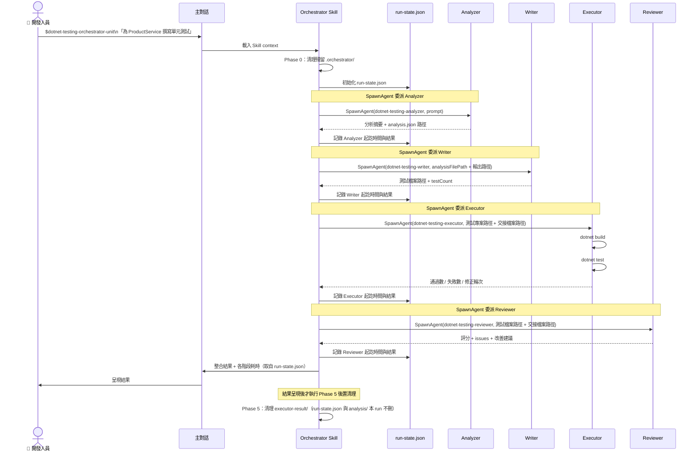

# 架構總覽

- [架構總覽](#架構總覽)
  - [1. 設計理念](#1-設計理念)
    - [Agent Orchestration](#agent-orchestration)
    - [Orchestrator 為 Skill、Subagent 由 SpawnAgent 調度](#orchestrator-為-skillsubagent-由-spawnagent-調度)
    - [run-state.json 稽核狀態檔](#run-statejson-稽核狀態檔)
  - [2. 系統架構圖](#2-系統架構圖)
  - [3. Agent 組成](#3-agent-組成)
  - [4. 標準工作流程](#4-標準工作流程)
  - [5. 執行循序圖](#5-執行循序圖)
  - [6. 關鍵設計決策](#6-關鍵設計決策)

---

## 1. 設計理念

### Agent Orchestration

Agent Orchestration 是一種多 AI 代理協作模式：由一個「指揮者」（Orchestrator）統籌協調多個「執行者」（Subagent），各司其職地完成複雜任務。

在本 repo 的架構中：

- **Orchestrator**：負責任務拆解、順序協調與結果整合，本身不撰寫任何測試程式碼
- **Subagent**：接受 Orchestrator 委派，專注執行單一職責（分析 / 撰寫 / 執行 / 審查）

這種分工讓每個 Subagent 的 context 保持精簡，避免單一 AI 實例因上下文過長導致品質下降。

### Orchestrator 為 Skill、Subagent 由 SpawnAgent 調度

本架構將 Orchestrator 定義為 **Skill**，將四個角色定義為 **Subagent**（`.codex/agents/*.toml`）：

- Orchestrator Skill（`dotnet-testing-orchestrator-unit`）載入主對話的 context
- 主對話載入 Skill 後，透過 Codex 原生 **SpawnAgent** 依序調度四個 Subagent
- 每個 Subagent 的定義檔（`.codex/agents/*.toml`）由 SpawnAgent 自動載入

> SpawnAgent 是 Codex 原生的多代理調度機制，與 Claude Code 的 Agent tool 不同。本 repo 由上游 Claude 版經 migrate-to-codex 轉換後，dispatch 已改用 Codex 原生 SpawnAgent。

### run-state.json 稽核狀態檔

工作流程執行過程中，Orchestrator 會維護一份 `run-state.json`（位於測試專案的 `.orchestrator/` 目錄下），記錄各階段的 wall-clock 起訖時間、subagent 結果與整體狀態。

- `run-state.json` 的 wall-clock 時間戳是**官方階段耗時與整體耗時的唯一真實來源**，不依賴 narration 或其他推算。
- `config.toml` 可選擇啟用 `codex_hooks` 作為額外 telemetry，但官方耗時一律以 `run-state.json` 為準。

> 本版**不提供正式 token 用量統計**：Codex native SpawnAgent subagent 的全流程 token 無可靠 truth source（實證確認）。可輸出 `Estimated Token Usage` optional telemetry，僅作 visible-context 相對成本比較，避免誤導為 billing truth。

---

## 2. 系統架構圖

---

## 3. Agent 組成

本版聚焦 Unit 測試，由 1 個 Orchestrator Skill 調度 4 個專屬 Subagent。

| 角色         | 類型     | 定義檔路徑                                         |
| ------------ | -------- | -------------------------------------------------- |
| Orchestrator | Skill    | `.codex/skills/dotnet-testing-orchestrator-unit/`  |
| Analyzer     | Subagent | `.codex/agents/dotnet-testing-analyzer.toml`       |
| Writer       | Subagent | `.codex/agents/dotnet-testing-writer.toml`         |
| Executor     | Subagent | `.codex/agents/dotnet-testing-executor.toml`       |
| Reviewer     | Subagent | `.codex/agents/dotnet-testing-reviewer.toml`       |

> Integration / Aspire / TUnit 的 Orchestrator 與對應 Subagent 為後續釋出 🚧。

---

## 4. 標準工作流程

> 上圖為**單目標**流程。**多目標**（一次指定多個被測類別）時：Analyzer **平行**（逐 target）、Writer **平行且各 target 仍可 per-class 分割**（dispatch 單位是「Writer assignment」非 target，故 N 個 target 可同時跑 > N 個 Writer）、Executor **循序**（同專案 build 不可並行）、Reviewer **平行**。詳見 [unit-orchestrator.md §9](unit-orchestrator.md)。

---

## 5. 執行循序圖

---

## 6. 關鍵設計決策

| 設計選擇          | 決策                          | 原因                                                                                         |
| ----------------- | ----------------------------- | -------------------------------------------------------------------------------------------- |
| Orchestrator 載體 | Skill（非 Subagent）          | Skill 在主對話中執行，才能透過 SpawnAgent 調度 Subagent；若定義為 Subagent 則身處子對話，無法再對外調度 |
| Dispatch 機制     | Codex 原生 SpawnAgent         | 由上游 Claude 版的 Agent tool 經 migrate-to-codex 轉換而來，改用 Codex 原生多代理調度          |
| 耗時量測          | run-state.json wall-clock     | wall-clock 時間戳是唯一真實來源；hooks 僅為可選 telemetry，官方耗時不依賴 narration            |
| Token 統計        | Estimated telemetry            | Codex native subagent 的全流程 token 無可靠 truth source（實證確認）；只輸出 `Estimated Token Usage` 作相對成本比較，不作 billing truth            |
| 大型類別處理      | Writer 分割：**setup 親和優先** | 方法數 > 5 或情境數 > 20 時拆為最多 2 個平行 Writer（**per-class/per-target 上限 2，非整個 workflow 全域**；多目標時 dispatch 單位是 assignment，三 target 可同時 > 3 Writer，實跑曾 5 Writer 並起）。**分組以「共用 setup 親和」為主、scenario 數平衡為次**（Codex 強化；非純貪心） |
| 分割多檔一致性    | **跨檔 fixture 一致契約**（Codex 強化）| 解決上游 Claude 版的 split 多檔 fixture 漂移：時間錨具名常數、AutoFixture 遞迴行為、欄位/變數命名、SUT 建構模式逐檔一致 |
| 建構子防禦覆蓋    | **建構子 null-guard 測試**（Codex 強化）| Analyzer 偵測 `constructorGuards[]`，Writer 為每個 guarded 依賴寫 `ArgumentNullException` 測試，集中單一檔；不改 production code |
| 可測試性邊界      | production-code 邊界政策      | 需 seam（IFileSystem/clock）即標 `requiresUserApproval`、不硬測；裸 `DateTime.*` 比照裸 `File.IO` 標 testabilityIssue |
| 階段內耗時量測    | run-state instrumentation（Codex 強化）| 逐 assignment `dispatchAcceptedAt`/`produceSpanMs`、`phaseDurations`、`profilingSummary`、`redispatchEvents`；量不到填 `null`+`notes` 不造假 |
| 階段間主動釋放    | phase boundary **固定動作** | 每個 phase 交接（Analyzer→Writer、Writer→Executor、Executor→Reviewer）主動 close 已完成 agents，釋放 thread slots；**runtime 不支援 close 時停手回報，不得改為限制/序列化 Writer 並行** |
| thread-ceiling 處理 | bounded re-dispatch（**僅撞限時**）| **只在** agent thread limit / capacity ceiling 或 artifact missing 等 bounded 條件出現時補派，**每 phase 最多 2 次**（`restartCount=0`，自癒）；不重啟整個流程 |
| 技能載入方式      | 動態載入技術型 Agent Skills   | Analyzer **依屬性**（依賴型別/targetType/門檻，非類別名）決定 Writer 需要哪些技能，按需載入 |
| 交接機制          | JSON 檔案（.orchestrator/）   | Subagent 間透過交接 JSON 傳遞結構化資料，而非在 prompt 中嵌入完整內容 |
| 清理策略          | 保留 analysis/ 與 run-state.json，刪除 executor-result/ | analysis.json + run-state 供 review 當證據；executor-result/ Phase 5 清；run-state 於下次 Phase 0 清（皆不進版控）  |
