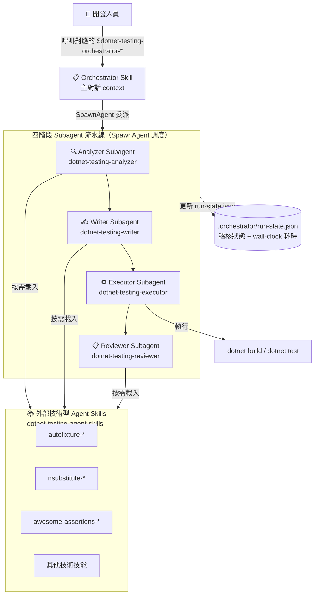
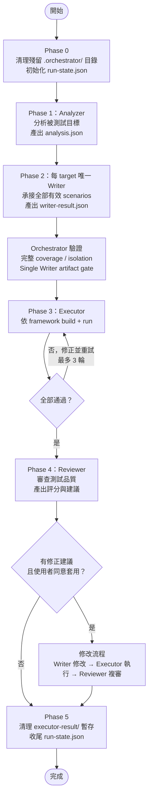
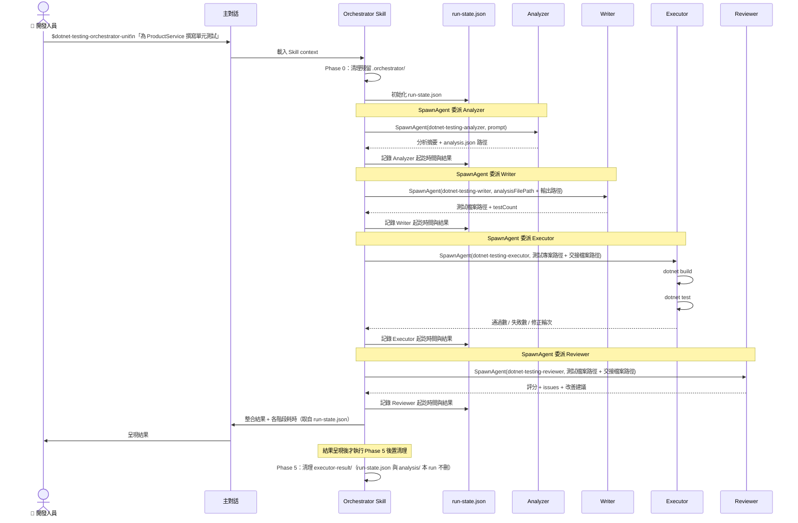

# 架構總覽

- [架構總覽](#架構總覽)
  - [1. 設計理念](#1-設計理念)
    - [Agent Orchestration](#agent-orchestration)
    - [Orchestrator 為 Skill、Subagent 由 SpawnAgent 調度](#orchestrator-為-skillsubagent-由-spawnagent-調度)
    - [run-state.json 稽核狀態檔](#run-statejson-稽核狀態檔)
  - [2. 系統架構圖](#2-系統架構圖)
  - [3. Agent 組成](#3-agent-組成)
  - [4. 標準工作流程](#4-標準工作流程)
  - [5. 執行循序圖](#5-執行循序圖)
  - [6. 關鍵設計決策](#6-關鍵設計決策)

---

## 1. 設計理念

### Agent Orchestration

Agent Orchestration 是一種多 AI 代理協作模式：由一個「指揮者」（Orchestrator）統籌協調多個「執行者」（Subagent），各司其職地完成複雜任務。

在本 repo 的架構中：

- **Orchestrator**：負責任務拆解、順序協調與結果整合，本身不撰寫任何測試程式碼
- **Subagent**：接受 Orchestrator 委派，專注執行單一職責（分析 / 撰寫 / 執行 / 審查）

這種分工讓每個 Subagent 的 context 保持精簡，避免單一 AI 實例因上下文過長導致品質下降。

### Orchestrator 為 Skill、Subagent 由 SpawnAgent 調度

本架構將 Orchestrator 定義為 **Skill**，將四個角色定義為 **Subagent**（`.codex/agents/*.toml`）：

- 對應的 Orchestrator Skill（`dotnet-testing-orchestrator-{unit,tunit,integration,aspire}`）載入主對話的 context
- 主對話載入 Skill 後，透過 Codex 原生 **SpawnAgent** 依序調度四個 Subagent
- 每個 Subagent 的定義檔（`.codex/agents/*.toml`）由 SpawnAgent 自動載入

> SpawnAgent 是 Codex 原生的多代理調度機制，與 Claude Code 的 Agent tool 不同。本 repo 由上游 Claude 版經 migrate-to-codex 轉換後，dispatch 已改用 Codex 原生 SpawnAgent。

### run-state.json 稽核狀態檔

工作流程執行過程中，Orchestrator 會維護一份 `run-state.json`（位於測試專案的 `.orchestrator/` 目錄下），記錄各階段的 wall-clock 起訖時間、subagent 結果與整體狀態。

- `run-state.json` 的 wall-clock 時間戳是**官方階段耗時與整體耗時的唯一真實來源**，不依賴 narration 或其他推算。
- `run-state.json` 由 `.codex/scripts/run-state.mjs` 確定性寫入；不得以 narration、人工估算或 optional telemetry 取代。

> 本版**不提供正式 token 用量統計**：Codex native SpawnAgent subagent 的全流程 token 無可靠 truth source（實證確認）。可輸出 `Estimated Token Usage` optional telemetry，僅作 visible-context 相對成本比較，避免誤導為 billing truth。

---

## 2. 系統架構圖

```mermaid
graph TD
    Dev[👤 開發人員] -->|呼叫對應的 $dotnet-testing-orchestrator-*| Skill[📋 Orchestrator Skill\n主對話 context]

    subgraph pipeline [四階段 Subagent 流水線（SpawnAgent 調度）]
        direction TB
        AN[🔍 Analyzer Subagent\ndotnet-testing-analyzer]
        WR[✍️ Writer Subagent\ndotnet-testing-writer]
        EX[⚙️ Executor Subagent\ndotnet-testing-executor]
        RV[📋 Reviewer Subagent\ndotnet-testing-reviewer]
        AN --> WR --> EX --> RV
    end

    subgraph external [📚 外部技術型 Agent Skills\ndotnet-testing-agent-skills]
        AS1[autofixture-*]
        AS2[nsubstitute-*]
        AS3[awesome-assertions-*]
        AS4[其他技術技能]
    end

    Skill -->|SpawnAgent 委派| pipeline
    pipeline -.->|更新 run-state.json| State[(.orchestrator/run-state.json\n稽核狀態 + wall-clock 耗時)]

    AN & WR & RV -->|按需載入| external
    EX -->|執行| DT[dotnet build / dotnet test]
```

---

## 3. Agent 組成

本 repo 涵蓋 **4 種工作流程**（unit / tunit / integration / aspire），各一套 1 + 4 模型：1 個 Orchestrator Skill 調度 4 個專屬 Subagent。下表以 **unit** 為例（其餘三種結構相同，agent 檔名前綴為 `dotnet-testing-advanced-{tunit,integration,aspire}-`）：

| 角色         | 類型     | 定義檔路徑（unit 範例）                            |
| ------------ | -------- | -------------------------------------------------- |
| Orchestrator | Skill    | `.codex/skills/dotnet-testing-orchestrator-unit/`  |
| Analyzer     | Subagent | `.codex/agents/dotnet-testing-analyzer.toml`       |
| Writer       | Subagent | `.codex/agents/dotnet-testing-writer.toml`         |
| Executor     | Subagent | `.codex/agents/dotnet-testing-executor.toml`       |
| Reviewer     | Subagent | `.codex/agents/dotnet-testing-reviewer.toml`       |

> tunit / integration / aspire 的 Orchestrator 與對應 Subagent 同樣已釋出（共 4 個 orchestrator skill + 16 個 subagent）；各自細節見 [tunit-orchestrator.md](tunit-orchestrator.md)、[integration-orchestrator.md](integration-orchestrator.md)、[aspire-orchestrator.md](aspire-orchestrator.md)。本頁以下的流程圖與循序圖以 **unit** 為例說明。

---

## 4. 標準工作流程

```mermaid
flowchart TD
    Start([開始]) --> P0[Phase 0\n清理殘留 .orchestrator/ 目錄\n初始化 run-state.json]
    P0 --> P1[Phase 1：Analyzer\n分析被測試目標\n產出 analysis.json]
    P1 --> P2[Phase 2：每 target 唯一 Writer\n承接全部有效 scenarios\n產出 writer-result.json]
    P2 --> P2Gate[Orchestrator 驗證\n完整 coverage / isolation\nSingle Writer artifact gate]
    P2Gate --> P3[Phase 3：Executor\n依 framework build + run]

    P3 --> ExecCheck{全部通過？}
    ExecCheck -- 否，修正並重試\n最多 3 輪 --> P3
    ExecCheck -- 是 --> P4[Phase 4：Reviewer\n審查測試品質\n產出評分與建議]

    P4 --> ReviewCheck{有修正建議\n且使用者同意套用？}
    ReviewCheck -- 否 --> P5[Phase 5\n清理 executor-result/ 暫存\n收尾 run-state.json]
    ReviewCheck -- 是 --> Mod[修改流程\nWriter 修改 → Executor 執行 → Reviewer 複審]
    Mod --> P5

    P5 --> End([完成])
```

> 上圖為**單目標**流程。多目標時，每個 target 各有一個 Analyzer、Writer 與 Reviewer；同一 target 永遠不 split。Unit/TUnit 可在不同 target 間平行 dispatch；Integration/Aspire 若共用測試專案、factory 或 AppHost 資源，Writers／Executors 依各自契約循序執行以避免 ownership 與容器衝突。

> Analyzer scenario 數不設上限。Single Writer 必須完整承接本次有效 scenarios；若 context/output limit 無法完成，保留證據並 fail closed，不得恢復 split 或刪減案例。

> **Phase 5 清理策略依 workflow 而異**：**unit** 在結果呈現後清理 `executor-result/`（`run-state.json` 與 `analysis/` 本 run 不刪，留作 review 證據，於下次 Phase 0 一併清）；**tunit / integration / aspire** 則**不自動清理**本次 `.orchestrator/` artifacts（`analysis/` / `writer-result/` / `executor-result/` / `reviewer-result/` / `run-state.json` 全數保留供驗收與 benchmark），同樣於下次 Phase 0 殘留清理時處理。各自詳見對應的 `*-orchestrator.md`。

---

## 5. 執行循序圖

```mermaid
sequenceDiagram
    actor Dev as 👤 開發人員
    participant Main as 主對話
    participant Skill as Orchestrator Skill
    participant State as run-state.json
    participant AN as Analyzer
    participant WR as Writer
    participant EX as Executor
    participant RV as Reviewer

    Dev->>Main: $dotnet-testing-orchestrator-unit\n「為 ProductService 撰寫單元測試」
    Main->>Skill: 載入 Skill context
    Skill->>Skill: Phase 0：清理殘留 .orchestrator/
    Skill->>State: 初始化 run-state.json

    Note over Skill,AN: SpawnAgent 委派 Analyzer
    Skill->>AN: SpawnAgent(dotnet-testing-analyzer, prompt)
    AN-->>Skill: 分析摘要 + analysis.json 路徑
    Skill->>State: 記錄 Analyzer 起訖時間與結果

    Note over Skill,WR: SpawnAgent 委派 Writer
    Skill->>WR: SpawnAgent(dotnet-testing-writer, analysisFilePath + 輸出路徑)
    WR-->>Skill: 測試檔案路徑 + testCount
    Skill->>State: 記錄 Writer 起訖時間與結果

    Note over Skill,EX: SpawnAgent 委派 Executor
    Skill->>EX: SpawnAgent(dotnet-testing-executor, 測試專案路徑 + 交接檔案路徑)
    EX->>EX: dotnet build
    EX->>EX: dotnet test
    EX-->>Skill: 通過數 / 失敗數 / 修正輪次
    Skill->>State: 記錄 Executor 起訖時間與結果

    Note over Skill,RV: SpawnAgent 委派 Reviewer
    Skill->>RV: SpawnAgent(dotnet-testing-reviewer, 測試檔案路徑 + 交接檔案路徑)
    RV-->>Skill: 評分 + issues + 改善建議
    Skill->>State: 記錄 Reviewer 起訖時間與結果

    Skill->>Main: 整合結果 + 各階段耗時（取自 run-state.json）
    Main->>Dev: 呈現結果
    Note over Skill: 結果呈現後才執行 Phase 5 後置清理
    Skill->>Skill: Phase 5：清理 executor-result/（run-state.json 與 analysis/ 本 run 不刪）
```

---

## 6. 關鍵設計決策

| 設計選擇          | 決策                          | 原因                                                                                         |
| ----------------- | ----------------------------- | -------------------------------------------------------------------------------------------- |
| Orchestrator 載體 | Skill（非 Subagent）          | Skill 在主對話中執行，才能透過 SpawnAgent 調度 Subagent；若定義為 Subagent 則身處子對話，無法再對外調度 |
| Dispatch 機制     | Codex 原生 SpawnAgent         | 由上游 Claude 版的 Agent tool 經 migrate-to-codex 轉換而來，改用 Codex 原生多代理調度          |
| 耗時量測          | run-state.json wall-clock     | wall-clock 時間戳是唯一真實來源；由 `.codex/scripts/run-state.mjs` 寫入，官方耗時不依賴 narration |
| Token 統計        | Estimated telemetry            | Codex native subagent 的全流程 token 無可靠 truth source（實證確認）；只輸出 `Estimated Token Usage` 作相對成本比較，不作 billing truth            |
| Writer topology   | 每 target 固定一個 Writer      | 移除重複載入 Writer contract、Skills、analysis 與 source context 的成本；不限制 Writer 可產生的測試檔數量 |
| 大型 target 處理  | Single Writer fail closed       | 不以 method/scenario/endpoint/Resource 數量分割；遇 context/output limit 回報 blocker，不刪減案例或臨時回退 split |
| 建構子防禦覆蓋    | **建構子 null-guard 測試**（Codex 強化）| Analyzer 偵測 `constructorGuards[]`，Writer 為每個 guarded 依賴寫 `ArgumentNullException` 測試，集中單一檔；不改 production code |
| 可測試性邊界      | production-code 邊界政策      | 需 seam（IFileSystem/clock）即標 `requiresUserApproval`、不硬測；裸 `DateTime.*` 比照裸 `File.IO` 標 testabilityIssue |
| 階段內耗時量測    | run-state instrumentation（Codex 強化）| 逐 assignment `dispatchAcceptedAt`/`produceSpanMs`、`phaseDurations`、`profilingSummary`、`redispatchEvents`；量不到填 `null`+`notes` 不造假 |
| 階段間主動釋放    | phase boundary **固定動作** | 每個 phase 交接（Analyzer→Writer、Writer→Executor、Executor→Reviewer）主動 close 已完成 agents，釋放 thread slots；runtime 不支援 close 時停手回報，不得以恢復同 target split 規避 |
| thread-ceiling 處理 | bounded re-dispatch（**僅撞限時**）| **只在** agent thread limit / capacity ceiling 或 artifact missing 等 bounded 條件出現時補派，**每 phase 最多 2 次**（`restartCount=0`，自癒）；不重啟整個流程 |
| 技能載入方式      | 動態載入技術型 Agent Skills   | Analyzer **依屬性**（依賴型別/targetType/門檻，非類別名）決定 Writer 需要哪些技能，按需載入 |
| 交接機制          | JSON 檔案（.orchestrator/）   | Subagent 間透過交接 JSON 傳遞結構化資料，而非在 prompt 中嵌入完整內容 |
| Context isolation | `fork_turns: none` + external memory forbid | formal roles 只讀 assigned source/project、repo-local Skills 與核准的 current-run handoffs；attempt isolation 與 role read scope fail closed |
| 清理策略          | **依 workflow 而異**（上為 unit） | **unit**：保留 analysis/ 與 run-state.json、Phase 5 刪 executor-result/；**tunit / integration / aspire**：Phase 5 不自動清，保留完整 `.orchestrator/` artifacts 供驗收/benchmark。兩者皆於下次 Phase 0 清殘留，皆不進版控 |
